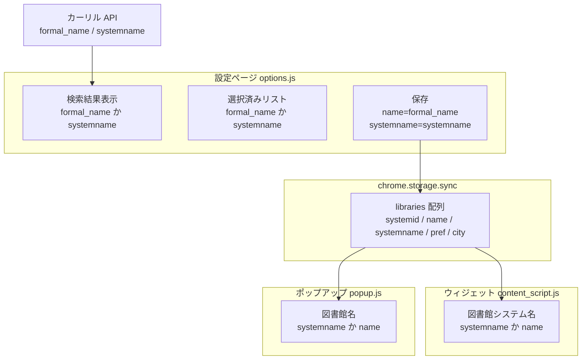
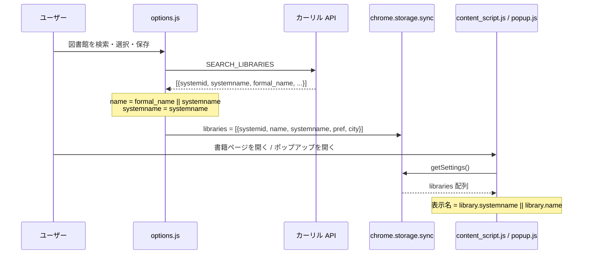

# 技術設計書 — library-formal-name

## Overview

本フィーチャーは、図書館蔵書チェッカーの設定ページにおける図書館名表示を正式名称（`formal_name`）に統一し、かつ書籍ページのウィジェット・ポップアップではシステム名称（`systemname`）を表示するよう整合させるものである。

**Purpose**: 設定ページ（`options.html`）では正式名称を、ウィジェット・ポップアップではシステム名称を表示することで、各コンテキストに適した名称表現を提供する。

**Users**: 拡張機能を使用するすべてのユーザー。特に複数図書館を登録しているユーザーが、設定ページでは正式名称で詳細確認し、書籍ページでは短いシステム名称で視認しやすくなる。

**Impact**: `chrome.storage.sync` の図書館データスキーマに `systemname` フィールドを追加し、ウィジェット・ポップアップの表示ロジックを更新する。

### Goals

- 設定ページの検索結果・選択済みリストで `formal_name`（フォールバック: `systemname`）を表示する
- ウィジェット・ポップアップで `systemname`（フォールバック: `name`）を表示する
- `chrome.storage.sync` の保存データに `systemname` を追加して一貫性を保つ
- 既存の保存データとの後方互換性を維持する

### Non-Goals

- カーリル API のレスポンスフォーマット変更
- `calil.js` API クライアントの変更
- 図書館選択上限（5 館）・検索ロジックの変更
- 既存の保存データのマイグレーション処理

---

## Boundary Commitments

### This Spec Owns

- `options.js` における検索結果・選択済みリストの名称表示ロジック
- `chrome.storage.sync` の `libraries` 配列スキーマ（`systemname` フィールド追加）
- `content_script.js` ウィジェットの図書館システム名表示ロジック
- `popup.js` ポップアップの図書館名表示ロジック

### Out of Boundary

- カーリル API クライアント（`calil.js`）の変更
- `service_worker.js` のメッセージ処理ロジックの変更
- CSS / スタイルの変更
- 既存保存データの自動マイグレーション

### Allowed Dependencies

- カーリル API `/library` レスポンス（`formal_name`・`systemname` フィールドを持つ）
- `chrome.storage.sync`（既存スキーマへの追加的変更）
- `sanitize.js` の `sanitizeText`（XSS 対策、変更なし）

### Revalidation Triggers

- カーリル API の `/library` レスポンスに `formal_name` または `systemname` フィールドがなくなった場合
- `chrome.storage.sync` のスキーマを変更する別フィーチャーが実装された場合

---

## Architecture

### Existing Architecture Analysis

現在のデータフロー:
1. `options.js` → `SEARCH_LIBRARIES` → `service_worker.js` → `calil.js:searchLibraries()` → カーリル API
2. API レスポンスの `formal_name || systemname` を `name` フィールドとして `selectedLibraries` に格納
3. `chrome.storage.sync.set({ libraries: selectedLibraries })` で保存
4. `content_script.js` / `popup.js` がストレージから読み込み、`library.name` を表示

**問題**: 保存データに `systemname` フィールドがないため、ウィジェット・ポップアップが独立してシステム名称を参照できない。

### Architecture Pattern & Boundary Map



**Key Decision**: `systemname` をストレージに追加することで、ウィジェット・ポップアップがストレージから直接取得できる。API の再呼び出しは不要。

### Technology Stack

| Layer | Choice / Version | Role | Notes |
|-------|-----------------|------|-------|
| Storage | chrome.storage.sync | 図書館データ永続化 | スキーマ拡張（`systemname` 追加） |
| Frontend | Vanilla JS（ES2020+） | UI ロジック変更 | TypeScript なし |

---

## File Structure Plan

### Modified Files

- `extension/options/options.js` — `selectedLibraries.push()` に `systemname` フィールドを追加（要件 3.1、4.4）
- `extension/content/content_script.js` — `library.name` → `library.systemname || library.name`（要件 4.1、4.3）
- `extension/popup/popup.js` — `library.name` → `library.systemname || library.name`（要件 4.2、4.3）

新規ファイルなし。

---

## System Flows



---

## Requirements Traceability

| 要件 | 概要 | コンポーネント | 変更内容 |
|------|------|--------------|---------|
| 1.1 | 検索結果に `formal_name` 表示 | options.js 検索結果表示 | 現行実装で対応済み |
| 1.2 | `formal_name` 空時に `systemname` フォールバック | options.js 検索結果表示 | 現行実装で対応済み |
| 1.3 | XSS 対策 `sanitizeText` 適用 | options.js 検索結果表示 | 現行実装で対応済み |
| 2.1 | 選択済みリストに `formal_name` 表示 | options.js 選択済みリスト | 現行実装で対応済み |
| 2.2 | 検索結果と選択済みリストの名称一致 | options.js 両リスト | 現行実装で対応済み |
| 3.1 | 保存データの `name` に `formal_name` 格納 | options.js 保存処理 | 現行実装で対応済み |
| 3.2 | ストレージ値はサニタイズ前の元文字列 | options.js 保存処理 | 現行実装で対応済み |
| 4.1 | ウィジェットに `systemname` 表示 | content_script.js | `library.systemname \|\| library.name` に変更 |
| 4.2 | ポップアップに `systemname` 表示 | popup.js | `library.systemname \|\| library.name` に変更 |
| 4.3 | `systemname` 空時に `name` フォールバック | content_script.js / popup.js | フォールバックロジック追加 |
| 4.4 | 保存データに `systemname` フィールド追加 | options.js 保存処理 | `systemname` フィールドを追加 |

---

## Components and Interfaces

### コンポーネントサマリー

| コンポーネント | 層 | 目的 | 要件カバレッジ | 変更種別 |
|---|---|---|---|---|
| options.js 保存処理 | UI / ストレージ | `systemname` をストレージスキーマに追加 | 4.4 | 追加 |
| content_script.js 表示 | コンテンツ UI | ウィジェット図書館名をシステム名称に変更 | 4.1, 4.3 | 変更 |
| popup.js 表示 | ポップアップ UI | ポップアップ図書館名をシステム名称に変更 | 4.2, 4.3 | 変更 |

---

### ストレージレイヤー

#### LibraryRecord スキーマ拡張

| Field | Detail |
|-------|--------|
| Intent | `chrome.storage.sync` の図書館データに `systemname` を追加 |
| Requirements | 4.4 |

**Contracts**: State [x]

##### State Management

現行スキーマ:
```javascript
// 変更前
{
  systemid: string,   // 図書館システムID (例: "Tokyo_Pref")
  name: string,       // 正式名称 (formal_name || systemname)
  pref: string,       // 都道府県
  city: string        // 市区町村
}
```

変更後スキーマ:
```javascript
// 変更後
{
  systemid: string,    // 図書館システムID (例: "Tokyo_Pref")
  name: string,        // 正式名称 (formal_name || systemname) — 設定ページ表示用
  systemname: string,  // システム名称 (systemname) — ウィジェット・ポップアップ表示用
  pref: string,        // 都道府県
  city: string         // 市区町村
}
```

**後方互換性**: `systemname` フィールドが存在しない旧保存データに対して、ウィジェット・ポップアップは `library.name` にフォールバックする。

---

### 設定ページレイヤー

#### options.js — 図書館選択・保存処理

| Field | Detail |
|-------|--------|
| Intent | チェックボックス選択時に `systemname` を `selectedLibraries` に追加して保存 |
| Requirements | 4.4 |

**Contracts**: State [x]

**変更箇所**: `selectedLibraries.push()` ブロック（現在の `name`, `pref`, `city` に `systemname` を追加）

```javascript
// 変更前
selectedLibraries.push({
  systemid: lib.systemid,
  name: lib.formal_name || lib.systemname,
  pref: lib.pref || '',
  city: lib.city || '',
});

// 変更後
selectedLibraries.push({
  systemid: lib.systemid,
  name: lib.formal_name || lib.systemname,
  systemname: lib.systemname || '',
  pref: lib.pref || '',
  city: lib.city || '',
});
```

**Implementation Notes**
- `sanitizeText` はストレージ保存ではなく DOM 挿入時のみに使用する（現行実装どおり）
- 検索結果・選択済みリストの表示ロジックは変更不要

---

### コンテンツ UI レイヤー

#### content_script.js — ウィジェット図書館名表示

| Field | Detail |
|-------|--------|
| Intent | ウィジェットの図書館システム名をシステム名称に変更 |
| Requirements | 4.1, 4.3 |

**Contracts**: State [x]

**変更箇所**: `setWidgetResults` 関数の `systemName` 変数

```javascript
// 変更前
const systemName = sanitizeText(library.name);

// 変更後
const systemName = sanitizeText(library.systemname || library.name);
```

---

### ポップアップ UI レイヤー

#### popup.js — ポップアップ図書館名表示

| Field | Detail |
|-------|--------|
| Intent | ポップアップの図書館名表示をシステム名称に変更 |
| Requirements | 4.2, 4.3 |

**Contracts**: State [x]

**変更箇所**: `renderResults` 関数内の `library.name` 参照（3 箇所）

```javascript
// 変更前（3箇所共通）
sanitizeText(library.name)

// 変更後（3箇所共通）
sanitizeText(library.systemname || library.name)
```

---

## Data Models

### ストレージスキーマ差分

`chrome.storage.sync` の `libraries` 配列要素に `systemname: string` を追加。

```
libraries[n].systemname  // 追加フィールド。空文字列を許容
```

旧データ互換: `systemname` がない場合は `undefined`。`library.systemname || library.name` のフォールバックで `name` が使用される。

---

## Error Handling

### フォールバック戦略

| 状況 | 対処 |
|------|------|
| `formal_name` が空 | `systemname` を使用（`options.js` 既存ロジック） |
| `systemname` が空 | `''`（空文字）をストレージに保存 |
| `library.systemname` が falsy（旧データ含む） | `library.name` にフォールバック（ウィジェット・ポップアップ） |

---

## Testing Strategy

### Unit Tests

- `options.js`: `selectedLibraries.push()` で `systemname` が正しく格納されることを確認
- `options.js`: `formal_name` が空の場合のフォールバック（既存テストで確認済みのため差分のみ）

### Integration Tests

- `content_script.js`: `library.systemname` があるデータでウィジェット表示が `systemname` になること
- `content_script.js`: `library.systemname` が空の旧データでウィジェット表示が `library.name` にフォールバックすること
- `popup.js`: 同上の確認をポップアップ側でも実施

### 対象テストファイル

- `tests/widget.test.js` — `library.systemname || library.name` のフォールバックテスト追加
- `tests/popup.test.js` — 同上
