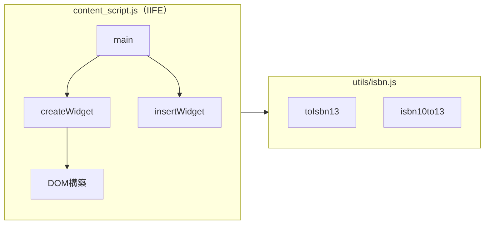

# Technical Design — remove-crosssite-links

## Overview

本フィーチャーは、図書館蔵書チェッカーウィジェットのフッターから「Amazonで見る」「楽天ブックスで見る」のクロスサイトリンクを削除する。ウィジェットを図書館蔵書確認の用途に特化させ、コードベースから未使用となる `buildCrossSiteLink`・`isbn13to10` 関数および関連するCSS・テスト・ドキュメントを除去する。

**Purpose**: ウィジェットの責務を「図書館蔵書確認」に絞り込む。  
**Users**: 拡張機能ユーザー（シンプルなUI）・開発者（不要コードの排除）。  
**Impact**: 既存コードの削除のみ。新しいコンポーネントや外部依存は不要。

### Goals

- ウィジェットフッターからクロスサイトリンクを完全に除去する
- `buildCrossSiteLink`・`isbn13to10` の関数・CSS・テスト・ドキュメントを整合的に削除する
- 削除後も蔵書確認・折りたたみなど既存機能が正常動作することを確認する

### Non-Goals

- ウィジェット以外の UI（ポップアップ・設定ページ）への変更
- 「設定を変更」「Powered by カーリル」フッターリンクへの変更
- 新機能の追加や他機能のリファクタリング

---

## Boundary Commitments

### This Spec Owns

- `extension/content/content_script.js` の `buildCrossSiteLink` 関数削除および `createWidget` シグネチャ変更
- `extension/utils/isbn.js` の `isbn13to10` 関数削除
- `extension/content/content_script.css` の `.calil-crosssite-link` スタイル削除
- テストファイル（`tests/isbn.test.js`・`tests/helpers/load-content-script.js`・`tests/widget.test.js`）の整合更新
- `docs/functional-design.md`・`docs/glossary.md` の対応記述削除

### Out of Boundary

- ポップアップ・設定ページ・サービスワーカーへの変更
- カーリルAPI通信ロジックへの変更
- 新しいリンク形式への置き換えや代替機能の追加

### Allowed Dependencies

- 既存の `sanitizeUrl` ユーティリティ（変更なし・現状維持）

### Revalidation Triggers

- `createWidget` のシグネチャ変更（`(site, isbn)` → `()`）が発生するため、`createWidget` を呼ぶテストコードは追随が必要

---

## Architecture

### Existing Architecture Analysis

コンテンツスクリプトは IIFE でラップされたバニラ JS で、`buildCrossSiteLink(site, isbn)` が `createWidget(site, isbn)` 内で呼び出されている。削除後は `createWidget` が引数を必要としなくなる。

```
createWidget(site, isbn)         →  createWidget()
  ├─ buildCrossSiteLink(site, isbn)   削除
  │    └─ isbn13to10(isbn)            削除（isbn.js）
  └─ DOM ウィジェット構築             変更なし
```

### Architecture Pattern & Boundary Map



- **削除前**: `createWidget` が `buildCrossSiteLink` → `isbn13to10` を呼んでいた
- **削除後**: `createWidget` は引数なし。`isbn13to10` への参照がなくなるため `isbn.js` から削除可能

### Technology Stack

| Layer | Choice | Role | Notes |
|-------|--------|------|-------|
| コンテンツスクリプト | Vanilla JS (ES2020) | ウィジェット構築 | フレームワークなし |
| ユーティリティ | isbn.js / sanitize.js | ISBN変換・サニタイズ | isbn13to10 削除対象 |
| スタイル | CSS | ウィジェット描画 | .calil-crosssite-link 削除対象 |
| テスト | Jest 29 + jsdom | 単体テスト | 削除関数のテスト除去 |

---

## File Structure Plan

### Modified Files

| ファイル | 変更内容 |
|---------|---------|
| `extension/content/content_script.js` | `buildCrossSiteLink` 関数削除・`createWidget(site, isbn)` → `createWidget()` に変更・`main()` 内の呼び出し変更 |
| `extension/utils/isbn.js` | `isbn13to10` 関数削除 |
| `extension/content/content_script.css` | `.calil-crosssite-link` スタイルブロック削除 |
| `tests/isbn.test.js` | `describe('isbn13to10', ...)` ブロック（4テストケース）削除 |
| `tests/helpers/load-content-script.js` | `Object.assign` 内の `isbn13to10,` エクスポート削除 |
| `tests/widget.test.js` | `createWidget('amazon', '9784873117386')` → `createWidget()` に変更（4箇所） |
| `docs/functional-design.md` | `isbn13to10` 行削除（Section 2.2）・UC-07 関連削除（Section 6・7・8） |
| `docs/glossary.md` | `クロスサイトリンク` 用語行・`calil-crosssite-link` CSSクラス行削除 |

---

## Requirements Traceability

| Requirement | Summary | 対象ファイル |
|-------------|---------|------------|
| 1.1 | Amazonページで楽天ブックスリンク非表示 | content_script.js |
| 1.2 | 楽天ブックスページでAmazonリンク非表示 | content_script.js |
| 1.3 | 「設定を変更」をフッター左端に、「Powered by カーリル」を維持 | content_script.js |
| 1.4 | 蔵書確認・折りたたみ動作に影響なし | content_script.js / テスト |
| 2.1 | `buildCrossSiteLink` 関数削除 | content_script.js |
| 2.2 | `isbn13to10` 関数削除 | isbn.js |
| 2.3 | `isbn13to10` 呼び出しなし | content_script.js |
| 3.1 | `.calil-crosssite-link` スタイル削除 | content_script.css |
| 4.1 | `isbn13to10` テストケース削除 | isbn.test.js |
| 4.2 | `isbn13to10` エクスポート削除 | load-content-script.js |
| 4.3 | `npm test` 全テスト成功 | 全テストファイル |
| 5.1 | `isbn13to10` をインターフェース表から削除 | functional-design.md |
| 5.2 | `calil-crosssite-link` CSSクラス定義削除 | glossary.md |
| 5.3 | UC-07 関連記述を削除 | functional-design.md |

---

## Components and Interfaces

### コンポーネント一覧

| Component | 対象ファイル | Intent | Req Coverage |
|-----------|------------|--------|--------------|
| createWidget | content_script.js | ウィジェットDOM生成（シグネチャ変更） | 1.1, 1.2, 1.3, 1.4, 2.1 |
| isbn13to10（削除） | isbn.js | ISBN-13→10変換（クロスサイトリンク用途のみ） | 2.2, 2.3 |
| .calil-crosssite-link（削除） | content_script.css | クロスサイトリンクスタイル | 3.1 |
| isbn13to10 tests（削除） | isbn.test.js / load-content-script.js | 削除済み関数のテスト | 4.1, 4.2 |
| ドキュメント整合 | functional-design.md / glossary.md | ドキュメントとコードの一致 | 5.1, 5.2, 5.3 |

### コンテンツスクリプト層

#### createWidget 関数（シグネチャ変更）

| Field | Detail |
|-------|--------|
| Intent | ウィジェットの DOM 要素を生成して返す |
| Requirements | 1.1, 1.2, 1.3, 1.4, 2.1 |

**Responsibilities & Constraints**
- ウィジェットルート要素（`#calil-library-checker`）・ヘッダー・ボディ・フッターを構築する
- フッターには「設定を変更」（左端）と「Powered by カーリル」のみを含める（クロスサイトリンクなし）
- フッターのHTML要素順序: `<a id="calil-settings-link">設定を変更</a>` を先頭に配置し、左端表示を保証する
- `site`・`isbn` パラメータを削除し、引数なし関数 `createWidget()` とする

**Dependencies**
- Inbound: `main()` — 呼び出し元（P0）
- Outbound: `sanitizeUrl`, `sanitizeText` — サニタイズ（変更なし、P1）

**Contracts**: Service [✓]

**変更前後のシグネチャ:**

```javascript
// 変更前
function createWidget(site, isbn) { ... }

// 変更後
function createWidget() { ... }
```

**Implementation Notes**
- `main()` 内の `createWidget(site, isbn)` 呼び出しも `createWidget()` に変更する
- `tests/widget.test.js` での `fns.createWidget('amazon', '9784873117386')` 呼び出し4箇所を `fns.createWidget()` に更新する

---

## Testing Strategy

### Unit Tests

- `isbn.test.js` から `describe('isbn13to10', ...)` ブロック（4テストケース）を削除する
- `tests/helpers/load-content-script.js` の `Object.assign` から `isbn13to10,` エクスポートを削除する
- `tests/widget.test.js` の `createWidget` 呼び出し4箇所を引数なし `createWidget()` に変更する
- 上記変更後 `npm test` で全テストが成功することを確認する

### 回帰確認

- 蔵書確認結果の表示（`setWidgetResults`）が正常動作すること
- 折りたたみ動作（`initToggleBehavior`）が正常動作すること
- 「設定を変更」「Powered by カーリル」リンクがフッターに表示されること
