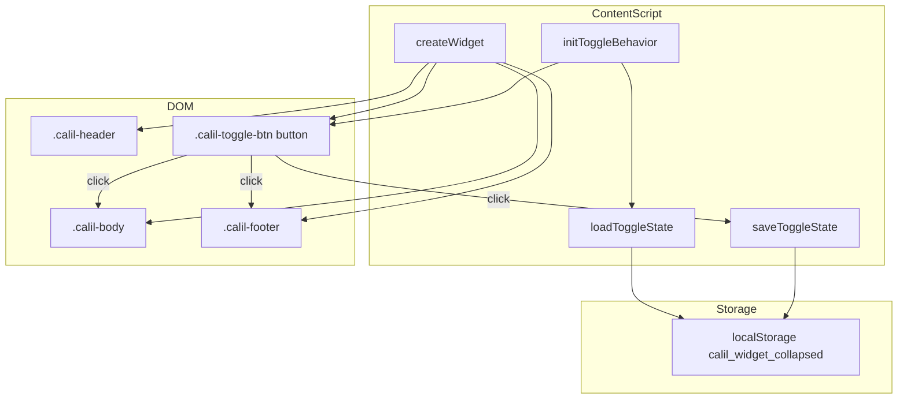
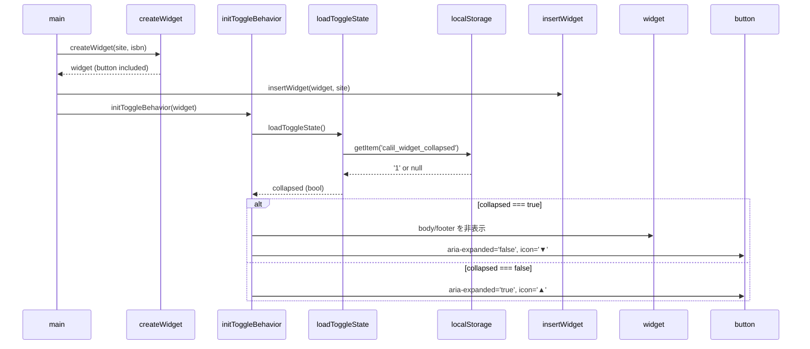
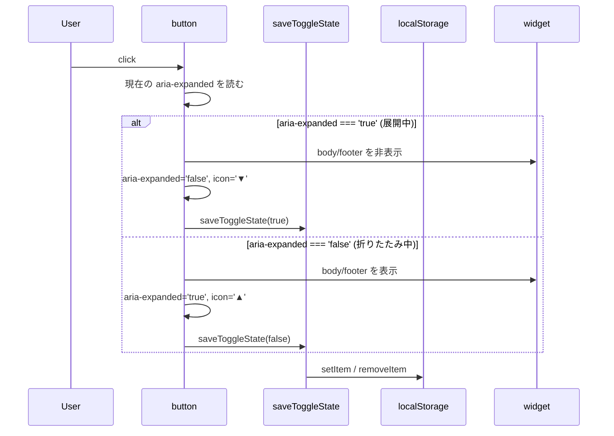

# 技術設計書: widget-collapse-toggle

## Overview

本機能は、図書館蔵書チェッカーウィジェットの右上に折りたたみトグルボタンを追加する。書籍閲覧中にウィジェットが邪魔に感じるユーザーが、ヘッダーを残したままボディとフッターをワンクリックで隠せるようにする。

**Purpose**: ウィジェットの表示/非表示を手軽に切り替えることで、書籍ページのコンテンツとの共存性を高める。  
**Users**: Amazon.co.jp・楽天ブックスの書籍ページで拡張機能を利用するユーザーが、ウィジェットの占有領域をコントロールするために使用する。  
**Impact**: `createWidget()` の HTML 構造と `content_script.css` のスタイルを変更する。既存の API 通信・設定管理・キャッシュロジックへの影響なし。

### Goals

- ウィジェットのボディ・フッターをワンクリックで折りたたみ/展開できる
- 折りたたみ状態を `localStorage` に永続化し、次回ページロード時に復元する
- `<button>` 要素と `aria-expanded` を使い、キーボードおよびスクリーンリーダー対応を確保する

### Non-Goals

- ポップアップ・設定ページ・サービスワーカーへの変更
- ウィジェットの完全削除（非表示と折りたたみは異なる）
- 折りたたみアニメーション

---

## Boundary Commitments

### This Spec Owns

- `extension/content/content_script.js` — トグルボタン生成・状態初期化・クリックハンドラ・`localStorage` 読み書き
- `extension/content/content_script.css` — `.calil-toggle-btn` のスタイル定義
- `tests/widget.test.js` — トグル機能のユニットテスト
- `tests/helpers/load-content-script.js` — 新規関数のエクスポート追加

### Out of Boundary

- サービスワーカー・ポップアップ・設定ページへの変更
- `manifest.json` の変更
- ウィジェット挿入位置（`insertWidget()`）の変更
- `chrome.storage` を使ったUI状態管理（`localStorage` で完結する）

### Allowed Dependencies

- ブラウザ標準 `localStorage` API（既存 `sessionStorage` と同一レイヤー）
- 既存 `createWidget()` の DOM 構造（`.calil-header`・`.calil-body`・`.calil-footer`）

### Revalidation Triggers

- `createWidget()` の HTML テンプレート変更（`.calil-header` 構造の変更）
- `tests/helpers/load-content-script.js` のテールパターン変更

---

## Architecture

### Existing Architecture Analysis

コンテンツスクリプトは Vanilla JS IIFE で実装されており、`createWidget()` がウィジェット DOM を生成し、`main()` が挿入・API 呼び出し・結果表示を統括する。イベントバインドは `createWidget()` 内（設定リンク）と `setWidgetSetupRequired()` 内（設定画面リンク）で行われており、本機能はこのパターンを踏襲する。

### Architecture Pattern & Boundary Map



**Architecture Integration**:
- 選択パターン: 既存ファイル拡張（Option A）
- 新規関数 `loadToggleState` / `saveToggleState` / `initToggleBehavior` を IIFE 内に追加
- `createWidget()` を修正してトグルボタンをヘッダー内に追加
- `main()` で `insertWidget()` の直後に `initToggleBehavior()` を呼び出す
- 既存パターン保持: try-catch によるストレージエラーのサイレント無視、`calil-` プレフィックス CSS クラス

### Technology Stack

| Layer | Choice / Version | Role | Notes |
|-------|-----------------|------|-------|
| UI | Vanilla JS (ES2020+) | トグルボタン生成・イベント処理 | 既存スタック踏襲 |
| Storage | `localStorage` (Web API) | 折りたたみ状態の永続化 | プロジェクト初採用。既存 `sessionStorage` と同パターンで実装 |
| Styling | CSS (既存 `content_script.css`) | `.calil-toggle-btn` スタイル | ボタンデフォルトスタイルリセット + ホバー指定 |
| Testing | Jest 29 + jsdom | 新規関数のユニットテスト | `localStorage` は jsdom が標準提供 |

---

## File Structure Plan

### Modified Files

```
extension/content/
├── content_script.js   # createWidget() 修正 + 3関数追加
└── content_script.css  # .calil-toggle-btn スタイル追加

tests/
├── widget.test.js                   # トグル機能テストケース追加
└── helpers/load-content-script.js  # エクスポートリストに新関数追加
```

- `extension/content/content_script.js` — `createWidget()` のヘッダー HTML にボタンを追加。`loadToggleState()`・`saveToggleState()`・`initToggleBehavior()` の3関数を追加。`main()` に `initToggleBehavior(widget)` 呼び出しを追加
- `extension/content/content_script.css` — `.calil-toggle-btn` のスタイル（ボタンリセット・フォントサイズ・cursor・hover）を追加
- `tests/widget.test.js` — トグルボタンの存在・クリック挙動・localStorage 永続化・aria 属性を検証するテストケースを追加
- `tests/helpers/load-content-script.js` — エクスポートオブジェクトに `loadToggleState`・`saveToggleState`・`initToggleBehavior` を追加

---

## System Flows

### 初期表示フロー（localStorage 状態復元）



### クリックトグルフロー



---

## Requirements Traceability

| 要件 | 概要 | コンポーネント | インターフェース | フロー |
|------|------|---------------|----------------|--------|
| 1.1 | ヘッダー右端にボタンを配置 | ToggleButton | `createWidget()` HTML | — |
| 1.2 | 状態を示すアイコン表示 | ToggleButton | `initToggleBehavior()` | 初期表示フロー |
| 1.3 | `createWidget()` 実行時に生成 | ToggleButton | `createWidget()` | — |
| 1.4 | `calil-toggle-btn` クラス付与 | ToggleButton | CSS | — |
| 2.1 | 展開中クリック → 折りたたみ | ToggleBehavior | `initToggleBehavior()` | クリックトグルフロー |
| 2.2 | 折りたたみ中クリック → 展開 | ToggleBehavior | `initToggleBehavior()` | クリックトグルフロー |
| 2.3 | 折りたたみ時ヘッダーのみ表示・アイコン更新 | ToggleBehavior | `initToggleBehavior()` | クリックトグルフロー |
| 2.4 | 展開時アイコンを折りたたみ方向に表示 | ToggleBehavior | `initToggleBehavior()` | クリックトグルフロー |
| 2.5 | 初期表示は展開状態 | ToggleBehavior | `initToggleBehavior()` | 初期表示フロー |
| 3.1 | 折りたたみ時に `localStorage` へ保存 | ToggleStateManager | `saveToggleState(true)` | クリックトグルフロー |
| 3.2 | 展開時に `localStorage` から削除/上書き | ToggleStateManager | `saveToggleState(false)` | クリックトグルフロー |
| 3.3 | 次回ロード時に状態を復元 | ToggleStateManager | `loadToggleState()` | 初期表示フロー |
| 3.4 | `localStorage` エラー時はデフォルト展開 | ToggleStateManager | `loadToggleState()` / `saveToggleState()` | — |
| 4.1 | `aria-expanded` 属性付与・同期 | ToggleButton | `initToggleBehavior()` | クリックトグルフロー |
| 4.2 | `title` 属性で操作内容を表示 | ToggleButton | `createWidget()` / `initToggleBehavior()` | — |
| 4.3 | キーボード操作対応 | ToggleButton | `<button>` 要素 | — |
| 4.4 | ホバー時 cursor: pointer | ToggleButton | CSS `.calil-toggle-btn` | — |

---

## Components and Interfaces

| コンポーネント | レイヤー | 役割 | 要件カバレッジ | 依存 | 契約 |
|---|---|---|---|---|---|
| ToggleButton | UI / DOM | ヘッダー右端のボタン要素生成・ARIA管理 | 1.1–1.4, 4.1–4.4 | `.calil-header` (P0) | State |
| ToggleBehavior | Logic | クリックイベント処理・表示切り替え | 2.1–2.5 | ToggleButton (P0), ToggleStateManager (P1) | State |
| ToggleStateManager | Storage | `localStorage` への状態読み書き | 3.1–3.4 | `localStorage` (P1) | State |

### UI / Logic Layer

#### ToggleButton

| Field | Detail |
|-------|--------|
| Intent | `.calil-header` 右端にトグルボタンを配置し、折りたたみ状態を `aria-expanded` で宣言する |
| Requirements | 1.1, 1.2, 1.3, 1.4, 4.1, 4.2, 4.3, 4.4 |

**Responsibilities & Constraints**
- `createWidget()` 内の `innerHTML` テンプレートに `<button>` 要素として組み込む
- ボタンは `.calil-header` 内に `margin-left: auto` で右寄せ配置（`flex` レイアウト利用）
- `<button type="button">` を使用することでキーボード操作（Enter/Space）を追加実装なしで実現
- アイコンは展開時 `▲`、折りたたみ時 `▼` の Unicode 文字を使用

**Dependencies**
- Outbound: `.calil-header` DOM 要素 — ボタンの親コンテナ (P0)

**Contracts**: State [x]

##### State Management
- 状態モデル: `aria-expanded` 属性値（`"true"` / `"false"`）が Single Source of Truth
- `initToggleBehavior()` が初期状態を設定し、クリックハンドラが毎回 `aria-expanded` を読んで次の状態を決定する

**Implementation Notes**
- `.calil-header` は `display: flex` のため、`<button>` に `margin-left: auto` を指定するだけで右寄せが実現できる
- CSS でブラウザデフォルトのボタンスタイルをリセット: `background: none; border: none; padding: 0 4px; cursor: pointer;`
- ボタンの `title` 属性は `initToggleBehavior()` 内で状態に応じて動的に更新する（`"折りたたむ"` / `"展開する"`）

---

#### ToggleBehavior

| Field | Detail |
|-------|--------|
| Intent | クリックイベントを処理し、`.calil-body` / `.calil-footer` の表示を切り替え、状態を永続化する |
| Requirements | 2.1, 2.2, 2.3, 2.4, 2.5 |

**Responsibilities & Constraints**
- `initToggleBehavior(widget)` 関数として実装
- `main()` 内で `insertWidget()` 成功後に呼び出す
- クリックハンドラは `aria-expanded` の現在値を読み取り、次状態を計算する（外部状態変数不使用）

**Dependencies**
- Inbound: `main()` — 初期化トリガー (P0)
- Outbound: ToggleStateManager (`loadToggleState` / `saveToggleState`) — 状態永続化 (P1)
- Outbound: `.calil-body` / `.calil-footer` DOM 要素 — 表示切り替え (P0)

**Contracts**: State [x]

##### State Management
- 状態モデル:

```
collapsed = aria-expanded === 'false'
```

- 初期化時: `loadToggleState()` の戻り値が `true` の場合、`.calil-body` / `.calil-footer` を `display: none` に設定し `aria-expanded="false"` にする
- トグル時: `aria-expanded` の現在値に基づき表示/非表示を反転し、`saveToggleState()` を呼ぶ

**Implementation Notes**
- `element.style.display = 'none'` / `element.style.display = ''` で表示切り替え。CSS クラスの付与/削除ではなく style プロパティを直接操作することで、他の CSS セレクタとの優先度競合を避ける
- `insertWidget()` が失敗した場合（`!widget.parentElement`）は `initToggleBehavior()` を呼ばない（`main()` の既存ガード節が継続する）

---

### Storage Layer

#### ToggleStateManager

| Field | Detail |
|-------|--------|
| Intent | `localStorage` への折りたたみ状態の読み書きをカプセル化し、エラー時はデフォルト展開にフォールバックする |
| Requirements | 3.1, 3.2, 3.3, 3.4 |

**Responsibilities & Constraints**
- `loadToggleState()` と `saveToggleState(collapsed)` の2関数として実装
- どちらも try-catch でエラーをサイレントに無視する（既存 `sessionStorage` パターンと同一）
- `localStorage` キー: `calil_widget_collapsed`
- 値: 折りたたみ時 `'1'`、展開時はキーを削除（`removeItem`）

**Dependencies**
- External: `localStorage` (Web API) — ブラウザ標準 API (P1)

**Contracts**: State [x]

##### State Management
- 状態モデル:

```
localStorage.getItem('calil_widget_collapsed') === '1'  → collapsed: true
localStorage.getItem('calil_widget_collapsed') === null → collapsed: false
```

- 永続化: オリジン単位（amazon.co.jp / rakuten.co.jp それぞれ独立）
- エラー時: `loadToggleState()` は `false`（展開状態）を返す。`saveToggleState()` はエラーを無視して状態変更なし

**Implementation Notes**
- `localStorage` が利用不可（プライベートブラウジング・CSP制限）の場合でも機能が停止しないよう、すべての操作を try-catch で保護する
- リスク: Chrome 拡張機能のコンテンツスクリプトは挿入先ページの `localStorage` にアクセスするため、ページがストレージへのアクセスを制限している場合は永続化が失敗する。既存の `sessionStorage` が問題なく動作しているため低リスクと判断（詳細: `research.md`）

---

## Data Models

### ストレージスキーマ

| キー | 値 | 型 | 意味 |
|------|----|----|------|
| `calil_widget_collapsed` | `'1'` | string | ウィジェットが折りたたまれている |
| `calil_widget_collapsed` | (キーなし) | — | ウィジェットが展開されている（デフォルト） |

---

## Error Handling

### Error Strategy

ストレージエラーは **サイレント無視 + デフォルト展開フォールバック**。UI の表示状態異常よりも機能継続を優先する（Graceful Degradation）。

### Error Categories and Responses

| エラー | 発生箇所 | 対応 |
|--------|---------|------|
| `localStorage` アクセス不可 | `loadToggleState()` | `false`（展開状態）を返す |
| `localStorage` 書き込み失敗 | `saveToggleState()` | エラーを無視・UI 状態はそのまま |

---

## Testing Strategy

### Unit Tests

新規テストケースを `tests/widget.test.js` に追加する。

| テスト対象 | 検証内容 | 要件 |
|-----------|---------|------|
| `createWidget()` | トグルボタン（`.calil-toggle-btn`）が `.calil-header` 内に存在する | 1.1, 1.3, 1.4 |
| `createWidget()` | 初期状態のボタン `aria-expanded` が `"true"` | 2.5, 4.1 |
| `initToggleBehavior()` | クリック後に `aria-expanded` が `"false"` になる | 2.1 |
| `initToggleBehavior()` | クリック後に `.calil-body` が `display: none` になる | 2.1, 2.3 |
| `initToggleBehavior()` | 2回クリックで `.calil-body` が表示状態に戻る | 2.2 |
| `loadToggleState()` | `localStorage` に `'1'` があれば `true` を返す | 3.3 |
| `loadToggleState()` | `localStorage` にキーがなければ `false` を返す | 3.3 |
| `saveToggleState(true)` | `localStorage` に `'1'` が保存される | 3.1 |
| `saveToggleState(false)` | `localStorage` からキーが削除される | 3.2 |
| `loadToggleState()` + `initToggleBehavior()` | 折りたたみ状態で初期化すると `aria-expanded="false"` かつ body 非表示 | 3.3 |

### Integration Notes

- `tests/helpers/load-content-script.js` の戻り値に `loadToggleState`・`saveToggleState`・`initToggleBehavior`・`createWidget` を追加する
- 各テストの `afterEach` で `localStorage.clear()` を呼び、テスト間の状態汚染を防ぐ
- jsdom は `localStorage` を標準サポートしているため、追加モックは不要
