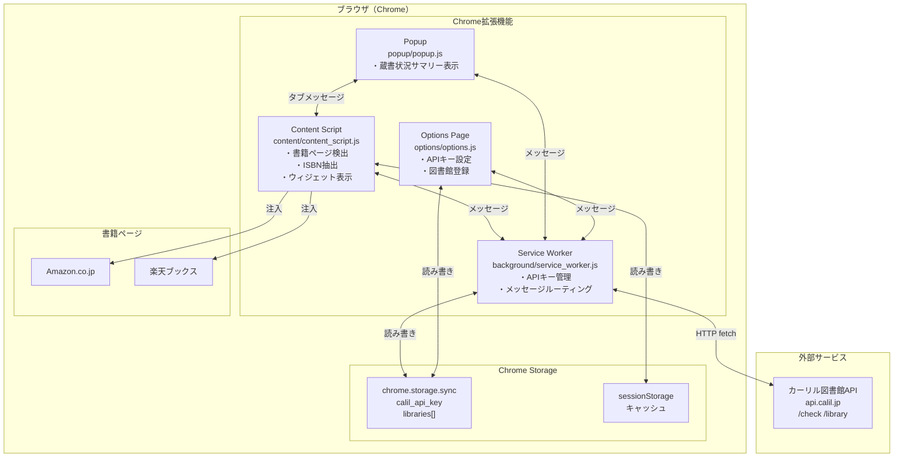
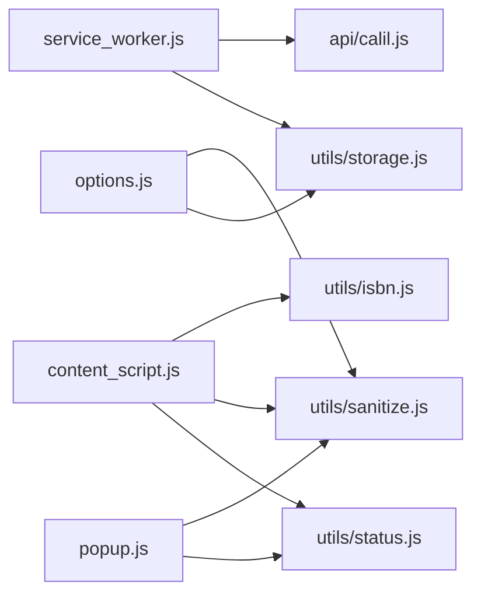
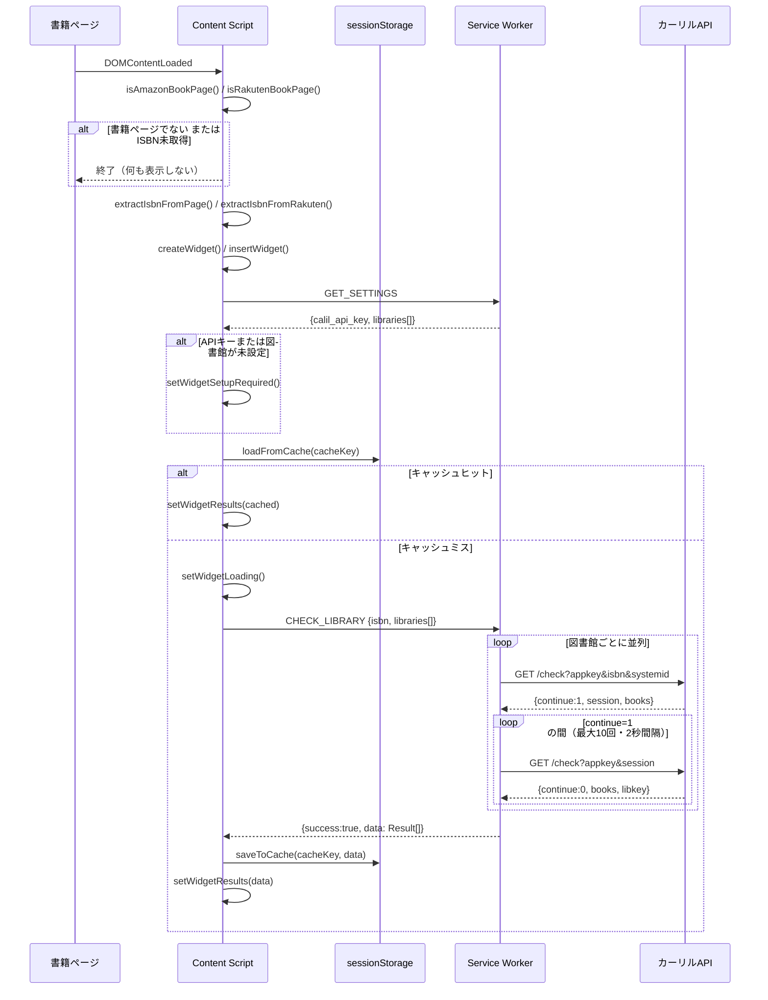
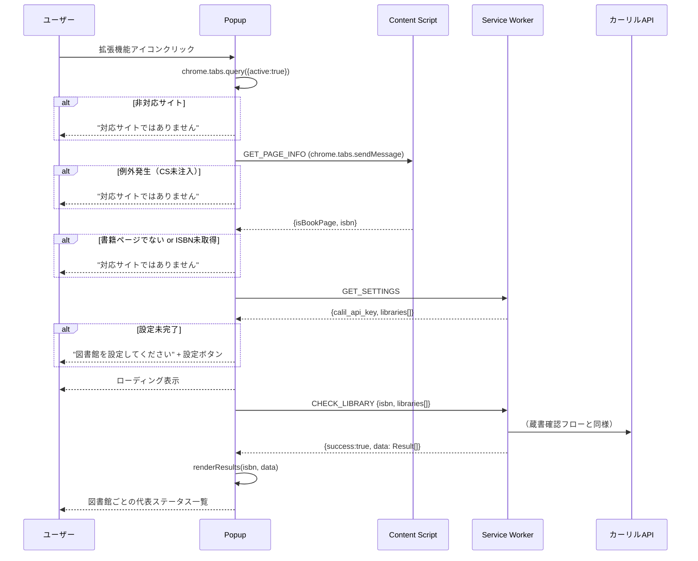
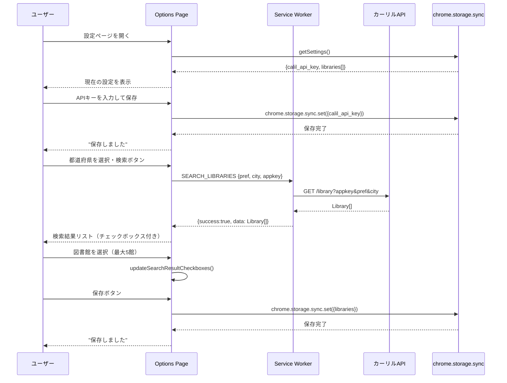
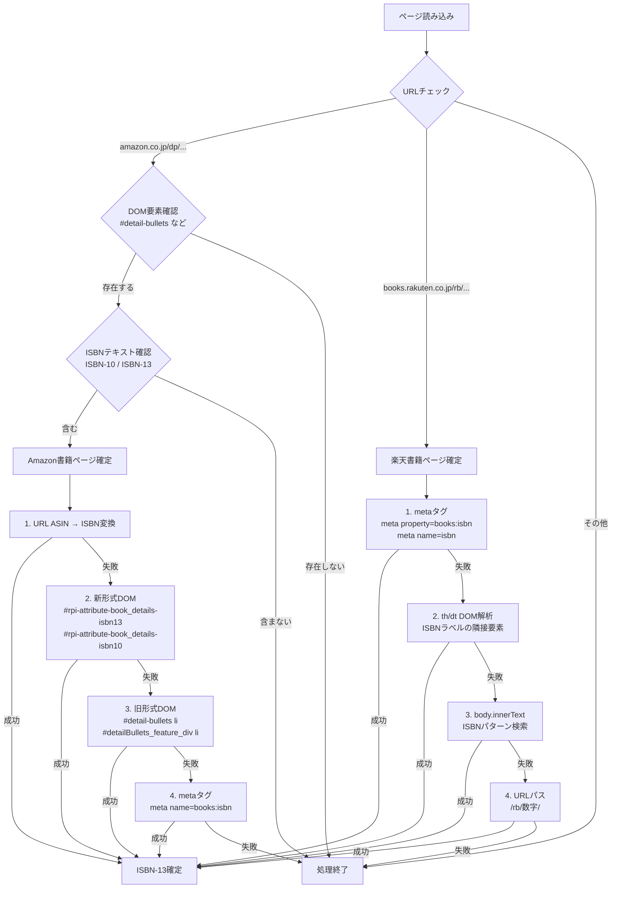
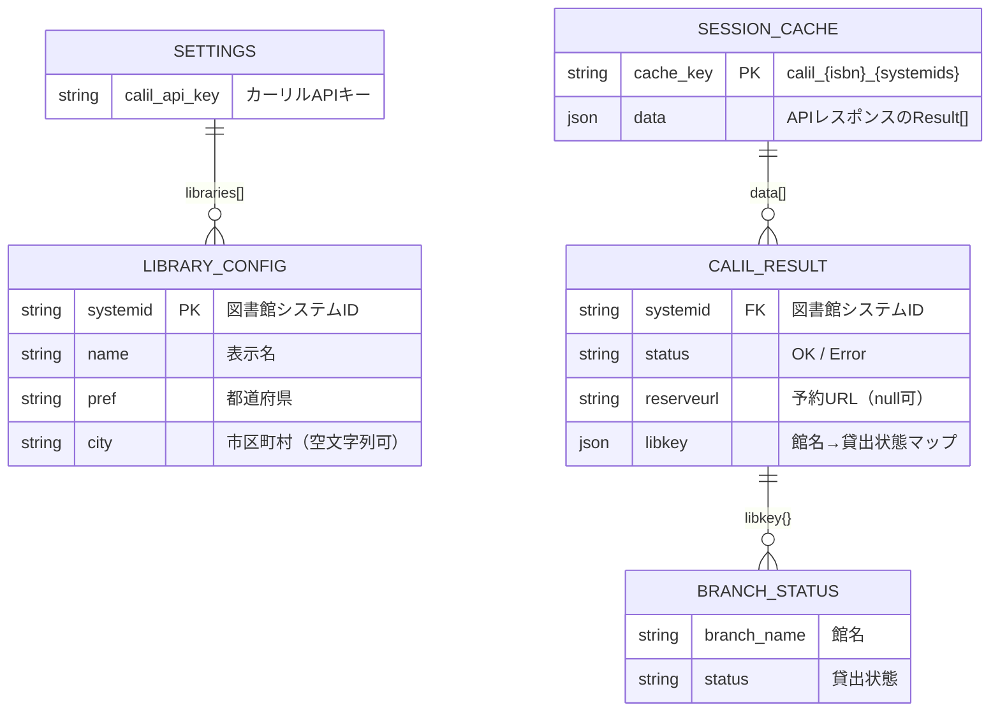
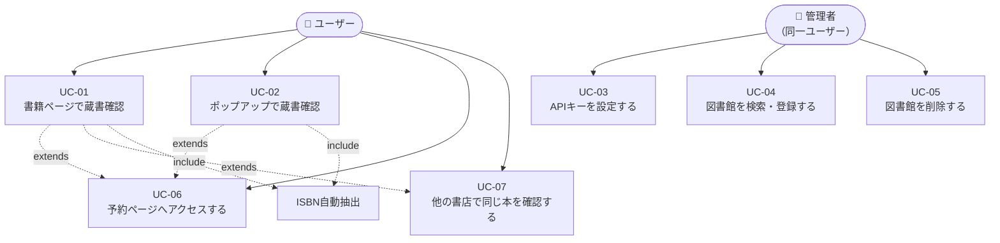
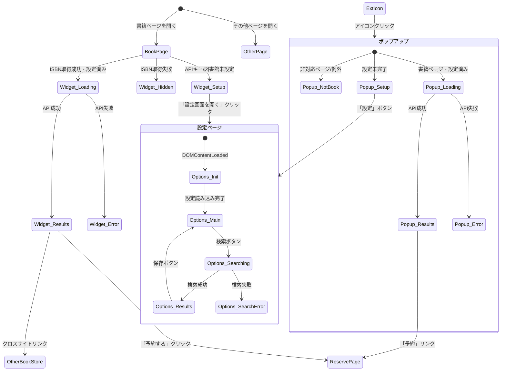
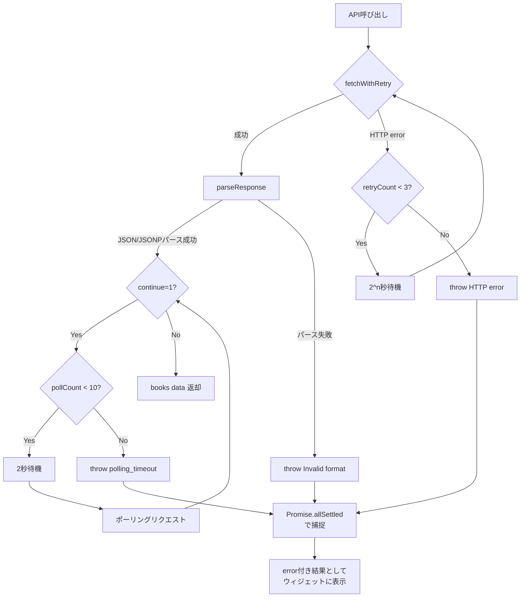

# 機能設計書 — 図書館蔵書チェッカー

| 項目 | 内容 |
|------|------|
| バージョン | 1.0.0 |
| 作成日 | 2026-04-06 |
| 対象 | Chrome 拡張機能（Manifest V3） |

---

## 目次

1. [システム構成図](#1-システム構成図)
2. [コンポーネント設計](#2-コンポーネント設計)
3. [機能ごとのアーキテクチャ](#3-機能ごとのアーキテクチャ)
4. [データモデル定義](#4-データモデル定義)
5. [メッセージ通信設計](#5-メッセージ通信設計)
6. [ユースケース図](#6-ユースケース図)
7. [画面遷移図](#7-画面遷移図)
8. [ワイヤフレーム](#8-ワイヤフレーム)
9. [エラーハンドリング設計](#9-エラーハンドリング設計)
10. [API設計](#10-api設計)

---

## 1. システム構成図

### 1.1 全体構成



### 1.2 コンポーネント依存関係



---

## 2. コンポーネント設計

### 2.1 コンポーネント一覧

| コンポーネント | ファイル | 実行コンテキスト | 責務 |
|--------------|---------|----------------|------|
| Service Worker | `background/service_worker.js` | バックグラウンド | APIキー保護・メッセージルーティング・API通信 |
| Content Script | `content/content_script.js` | 書籍ページDOM | 書籍検出・ISBN抽出・ウィジェット管理 |
| Popup | `popup/popup.js` | 拡張機能ポップアップ | 蔵書状況サマリー表示 |
| Options Page | `options/options.js` | 設定ページタブ | APIキー・図書館設定管理 |
| Calil API | `api/calil.js` | バックグラウンド | カーリルAPI通信・ポーリング・リトライ |
| ISBN Utils | `utils/isbn.js` | Content Script | ISBN正規化・変換・抽出 |
| Sanitize Utils | `utils/sanitize.js` | 全コンテキスト | XSS対策テキスト・URLサニタイズ |
| Status Utils | `utils/status.js` | Content Script / Popup | 貸出状態→CSSクラス変換 |
| Storage Utils | `utils/storage.js` | 全コンテキスト | chrome.storage.sync 読み込みラッパー |

### 2.2 各コンポーネントの公開インターフェース

#### service_worker.js — メッセージハンドラ

| メッセージタイプ | ハンドラ関数 | 説明 |
|----------------|------------|------|
| `CHECK_LIBRARY` | `handleCheckLibrary(payload)` | ISBN + 図書館リストで蔵書確認 |
| `SEARCH_LIBRARIES` | `handleSearchLibraries(payload)` | 都道府県・市区町村で図書館検索 |
| `GET_SETTINGS` | `getSettings()` | 設定（APIキー・図書館）を返す |
| `OPEN_OPTIONS` | `chrome.runtime.openOptionsPage()` | 設定ページを開く |

#### api/calil.js — 関数

| 関数 | シグネチャ | 説明 |
|------|-----------|------|
| `checkLibrary` | `(appkey, isbn, systemid) → Promise<Object\|null>` | 単一図書館の蔵書確認（ポーリング込み） |
| `checkLibraries` | `(appkey, isbn, libraries[]) → Promise<Result[]>` | 複数図書館の並列蔵書確認 |
| `searchLibraries` | `(appkey, pref, city?) → Promise<Library[]>` | 図書館検索 |

#### utils/isbn.js — 関数

| 関数 | シグネチャ | 説明 |
|------|-----------|------|
| `normalizeIsbn` | `(isbn) → string` | ハイフン・スペース除去 |
| `isValidIsbn13` | `(isbn) → boolean` | ISBN-13 チェックデジット検証 |
| `isValidIsbn10` | `(isbn) → boolean` | ISBN-10 チェックデジット検証 |
| `isbn10to13` | `(isbn10) → string\|null` | ISBN-10 → ISBN-13 変換 |
| `toIsbn13` | `(isbn) → string\|null` | 任意形式 → ISBN-13 変換 |
| `extractAsinFromUrl` | `(url) → string\|null` | Amazon URL から ASIN 抽出 |
| `extractIsbnFromPage` | `() → string\|null` | Amazon ページから ISBN 抽出 |
| `extractIsbnFromRakuten` | `() → string\|null` | 楽天ブックスページから ISBN 抽出 |

#### utils/sanitize.js — 関数

| 関数 | シグネチャ | 説明 |
|------|-----------|------|
| `sanitizeText` | `(text) → string` | HTML エスケープ（createTextNode 経由） |
| `sanitizeUrl` | `(url) → string` | http/https のみ許可、それ以外は `'#'` |

#### utils/status.js — 関数

| 関数 | シグネチャ | 説明 |
|------|-----------|------|
| `getStatusClass` | `(status) → string` | 貸出状態文字列 → CSS クラス名 |

| 貸出状態 | CSSクラス |
|---------|----------|
| `貸出可` | `available` |
| `貸出中` | `on-loan` |
| `休館中` / `蔵書なし` | `none` |
| それ以外 | `other` |

#### utils/storage.js — 関数

| 関数 | シグネチャ | 説明 |
|------|-----------|------|
| `getSettings` | `() → Promise<Settings>` | APIキー・図書館リストを取得 |

---

## 3. 機能ごとのアーキテクチャ

### 3.1 蔵書確認機能（ページ内ウィジェット）



### 3.2 ポップアップ表示機能



### 3.3 図書館設定機能



### 3.4 書籍ページ判定とISBN抽出



---

## 4. データモデル定義

### 4.1 ER図



### 4.2 chrome.storage.sync スキーマ

```typescript
interface Settings {
  calil_api_key: string;       // カーリルAPIキー（空文字列 = 未設定）
  libraries: LibraryConfig[];  // 登録図書館リスト（最大5件）
}

interface LibraryConfig {
  systemid: string;  // 図書館システムID（例: "Tokyo_Pref"）
  name:     string;  // 表示名（formal_name または systemname）
  pref:     string;  // 都道府県（例: "東京都"）
  city:     string;  // 市区町村（省略時は空文字列""）
}
```

**保存例:**
```json
{
  "calil_api_key": "xxxxxxxxxxxxxxxxxxxxxxxxxxxxxxxx",
  "libraries": [
    { "systemid": "Tokyo_Pref", "name": "東京都立図書館", "pref": "東京都", "city": "" },
    { "systemid": "Chiyoda_Tokyo", "name": "千代田区立図書館", "pref": "東京都", "city": "千代田区" }
  ]
}
```

### 4.3 sessionStorage キャッシュスキーマ

**キー形式:**
```
calil_{ISBN-13}_{systemid1,systemid2,...}
（systemid はアルファベット昇順ソート・カンマ区切り）

例: calil_9784873117386_Chiyoda_Tokyo,Tokyo_Pref
```

**値（JSON文字列）:**
```typescript
type CacheData = CheckResult[];

interface CheckResult {
  library: LibraryConfig;
  result:  CalilBookResult | null;
  error:   string | null;
}

interface CalilBookResult {
  status:     "OK" | "Error";
  reserveurl: string;            // 予約URL（空文字列可）
  libkey:     Record<string, string>;  // {"館名": "貸出状態"}
}
```

### 4.4 カーリルAPI レスポンス構造

#### /check レスポンス（ポーリング完了時）

```typescript
interface CalilCheckResponse {
  session:  string;   // セッションID
  continue: 0 | 1;   // 0=完了, 1=処理中
  books: {
    [isbn: string]: {
      [systemid: string]: {
        status:     "OK" | "Error" | "Running";
        reserveurl: string;
        libkey:     Record<string, LoanStatus>;
      }
    }
  }
}

type LoanStatus =
  | "貸出可"
  | "貸出中"
  | "館内のみ"
  | "予約中"
  | "準備中"
  | "休館中"
  | "蔵書なし";
```

#### /library レスポンス

```typescript
type CalilLibraryResponse = LibraryInfo[];

interface LibraryInfo {
  systemid:    string;  // 図書館システムID（ユニークキー）
  systemname:  string;  // システム英語名
  formal_name: string;  // 日本語正式名称（優先表示）
  pref:        string;  // 都道府県
  city:        string;  // 市区町村
  address:     string;  // 住所
  tel:         string;  // 電話番号
  url:         string;  // 図書館WebサイトURL
  geocode:     string;  // "経度,緯度"形式
}
```

---

## 5. メッセージ通信設計

### 5.1 メッセージ一覧

| タイプ | 送信元 | 受信先 | 通信方法 |
|--------|--------|--------|---------|
| `CHECK_LIBRARY` | Content Script / Popup | Service Worker | `chrome.runtime.sendMessage` |
| `SEARCH_LIBRARIES` | Options Page | Service Worker | `chrome.runtime.sendMessage` |
| `GET_SETTINGS` | Content Script / Popup | Service Worker | `chrome.runtime.sendMessage` |
| `OPEN_OPTIONS` | Content Script / Popup | Service Worker | `chrome.runtime.sendMessage` |
| `GET_PAGE_INFO` | Popup | Content Script | `chrome.tabs.sendMessage` |

### 5.2 メッセージ型定義

```typescript
// CHECK_LIBRARY
type CheckLibraryRequest = {
  type: "CHECK_LIBRARY";
  payload: { isbn: string; libraries: LibraryConfig[] };
};
type CheckLibraryResponse =
  | { success: true;  data: CheckResult[] }
  | { success: false; error: "api_key_not_set" | "no_libraries_set" | string };

// SEARCH_LIBRARIES
type SearchLibrariesRequest = {
  type: "SEARCH_LIBRARIES";
  payload: { pref: string; city?: string; appkey: string };
};
type SearchLibrariesResponse =
  | { success: true;  data: LibraryInfo[] }
  | { success: false; error: string };

// GET_SETTINGS
type GetSettingsRequest  = { type: "GET_SETTINGS" };
type GetSettingsResponse =
  | { success: true;  data: Settings }
  | { success: false; error: string };

// OPEN_OPTIONS
type OpenOptionsRequest  = { type: "OPEN_OPTIONS" };
// レスポンスなし

// GET_PAGE_INFO
type GetPageInfoRequest  = { type: "GET_PAGE_INFO" };
type GetPageInfoResponse = { isBookPage: boolean; isbn: string | null };
```

---

## 6. ユースケース図



### ユースケース詳細

| UC | ユースケース | アクター | 事前条件 | 基本フロー | 例外フロー |
|----|------------|---------|---------|-----------|-----------|
| UC-01 | 書籍ページで蔵書確認 | ユーザー | APIキーと図書館が設定済み | Amazon/楽天の書籍ページを開く → ウィジェットが自動表示 → 蔵書状況を確認 | ISBNが取得できない → ウィジェット非表示 |
| UC-02 | ポップアップで蔵書確認 | ユーザー | 書籍ページを表示中 | 拡張機能アイコンをクリック → ポップアップで各図書館の代表ステータスを確認 | 非対応ページ → 案内メッセージ |
| UC-03 | APIキーを設定する | 管理者 | カーリルAPIキーを取得済み | 設定ページを開く → APIキーを入力 → 保存 | 無効なキー → エラーはAPIコール時まで検知されない |
| UC-04 | 図書館を検索・登録する | 管理者 | APIキーが設定済み | 都道府県を選択 → 検索 → チェックボックスで選択 → 保存（最大5館） | 5館選択済みで追加 → チェックボックス無効 |
| UC-05 | 図書館を削除する | 管理者 | 図書館が1件以上登録済み | 設定ページの登録図書館の「削除」ボタンをクリック → 保存 | — |
| UC-06 | 予約ページへアクセスする | ユーザー | 蔵書確認済み・reserveurl存在 | ウィジェットまたはポップアップの「予約する」リンクをクリック → 図書館予約ページへ遷移 | reserveurl なし → リンク非表示 |
| UC-07 | 他書店で同じ本を確認する | ユーザー | 書籍ページを表示中 | ウィジェットフッターの「Amazonで見る」または「楽天ブックスで見る」をクリック | — |

---

## 7. 画面遷移図



---

## 8. ワイヤフレーム

### 8.1 ページ内ウィジェット

```
┌─────────────────────────────────────────────┐
│ 📚 図書館蔵書チェッカー                      │
├─────────────────────────────────────────────┤
│ ┌─ 東京都立図書館 ─────────── [予約する] ──┐ │
│ │ ● 中央図書館      貸出可                │ │  ● = 緑
│ │ ● 多摩図書館      貸出中                │ │  ● = 黄
│ └──────────────────────────────────────────┘ │
│ ┌─ 千代田区立図書館 ────────────────────── ┐ │
│ │ ○ この図書館には蔵書がありません         │ │  ○ = グレー
│ └──────────────────────────────────────────┘ │
├─────────────────────────────────────────────┤
│ [設定を変更] [楽天ブックスで見る] Powered by カーリル│
└─────────────────────────────────────────────┘

【ローディング状態】
┌─────────────────────────────────────────────┐
│ 📚 図書館蔵書チェッカー                      │
├─────────────────────────────────────────────┤
│  ⟳ 図書館蔵書を確認中...                    │
└─────────────────────────────────────────────┘

【設定未完了状態】
┌─────────────────────────────────────────────┐
│ 📚 図書館蔵書チェッカー                      │
├─────────────────────────────────────────────┤
│  図書館を設定してください。[設定画面を開く]  │
└─────────────────────────────────────────────┘
```

### 8.2 ポップアップ（popup.html）

```
┌──────────────────────────────┐  幅: 320px
│ 📚 図書館蔵書チェッカー  [設定]│  ← ヘッダー（常時表示）
├──────────────────────────────┤
│ ISBN: 9784873117386           │
│ ─────────────────────────────│
│ ● 東京都立図書館  貸出可 [予約]│  ● = 緑
│ ● 千代田区立図書館 貸出中      │  ● = 黄
│ ○ 大阪府立図書館  蔵書なし    │  ○ = グレー
├──────────────────────────────┤
│     Powered by カーリル       │  ← フッター
└──────────────────────────────┘

【非対応ページ】
┌──────────────────────────────┐
│ 📚 図書館蔵書チェッカー  [設定]│
├──────────────────────────────┤
│  Amazon または 楽天ブックスの  │
│  書籍ページで開いてください    │
└──────────────────────────────┘

【設定未完了】
┌──────────────────────────────┐
│ 📚 図書館蔵書チェッカー  [設定]│
├──────────────────────────────┤
│  図書館が設定されていません    │
│       [設定を開く]             │
└──────────────────────────────┘
```

### 8.3 設定ページ（options.html）

```
図書館蔵書チェッカー 設定
══════════════════════════════════════════

■ カーリル API キー
  ┌──────────────────────────────────┐
  │ xxxxxxxxxxxxxxxxxxxxxxxxxx       │
  └──────────────────────────────────┘
  [保存する]  ✓ 保存しました

══════════════════════════════════════════

■ 図書館を検索
  都道府県: [東京都          ▼]
  市区町村: [千代田区            ]
  [検索する]

  ─ 検索結果 ── 3件見つかりました ──────
  ☑ 東京都立図書館
    東京都  / Tokyo_Pref
  ☑ 千代田区立図書館
    東京都 千代田区 / Chiyoda_Tokyo
  ☐ 国立国会図書館（館内のみ）     ← 5館達した場合disabled
    東京都 千代田区 / Kokkai

══════════════════════════════════════════

■ 登録済みの図書館  2 / 5
  東京都立図書館          東京都          [削除]
  千代田区立図書館        東京都 千代田区  [削除]

  [保存する]  ✓ 保存しました
```

---

## 9. エラーハンドリング設計

### 9.1 エラー一覧

| エラーID | 発生箇所 | 原因 | 処理 | ユーザー表示 |
|---------|---------|------|------|-------------|
| `E-01` | content_script | ISBN取得失敗 | ウィジェット非表示で終了 | （非表示） |
| `E-02` | content_script | 書籍ページ外 | ウィジェット非表示で終了 | （非表示） |
| `E-03` | content_script | ウィジェット挿入失敗（DOM不一致） | 処理終了 | （非表示） |
| `E-04` | content_script / popup | `api_key_not_set` | 設定誘導を表示 | 設定未完了メッセージ |
| `E-05` | content_script / popup | `no_libraries_set` | 設定誘導を表示 | 設定未完了メッセージ |
| `E-06` | content_script / popup | 設定取得通信失敗 | エラー表示 | 「設定の取得に失敗しました」 |
| `E-07` | calil.js | HTTP エラー（3回リトライ後） | throw → 図書館単位エラー | 赤アイコン + 「確認に失敗しました」 |
| `E-08` | calil.js | ポーリングタイムアウト（10回超過） | throw `polling_timeout` | 赤アイコン + 「確認に失敗しました」 |
| `E-09` | calil.js | レスポンスパース失敗 | throw → 図書館単位エラー | 赤アイコン + 「確認に失敗しました」 |
| `E-10` | popup | コンテンツスクリプト未注入（sendMessage例外） | `not-book-page` 表示 | 「対応サイトではありません」 |
| `E-11` | options | 都道府県未選択で検索 | フォームバリデーション | 「都道府県を選択してください」 |
| `E-12` | options | APIキー未入力で検索 | フォームバリデーション | 「APIキーを入力してください」 |
| `E-13` | options | 図書館検索失敗 | エラーメッセージ表示 | 「検索に失敗しました（{error}）」 |
| `E-14` | options | 設定保存失敗 | エラーメッセージ表示 | 「保存に失敗しました」 |
| `E-15` | content_script | sessionStorage 保存失敗 | 無視（キャッシュなしで続行） | （非表示） |

### 9.2 エラー処理フロー



---

## 10. API設計

### 10.1 現行：カーリルAPI連携仕様

#### 蔵書確認 — GET /check

| 項目 | 値 |
|------|---|
| URL | `https://api.calil.jp/check` |
| メソッド | GET |
| 認証 | `appkey` クエリパラメータ |

**リクエストパラメータ:**

| パラメータ | 型 | 必須 | 説明 |
|-----------|-----|------|------|
| `appkey` | string | ○ | APIキー |
| `isbn` | string | ○（初回） | ISBN-13 |
| `systemid` | string | ○（初回） | 図書館システムID |
| `session` | string | ○（ポーリング時） | セッションID |
| `format` | string | — | `"json"` 固定 |

**ポーリング仕様:**
- `continue=1` の間は `session` パラメータを付けて 2秒以上の間隔で再リクエスト
- 最大10回、超過時は `polling_timeout` エラー

#### 図書館検索 — GET /library

| 項目 | 値 |
|------|---|
| URL | `https://api.calil.jp/library` |
| メソッド | GET |

**リクエストパラメータ:**

| パラメータ | 型 | 必須 | 説明 |
|-----------|-----|------|------|
| `appkey` | string | ○ | APIキー |
| `pref` | string | ○ | 都道府県名（例: `"東京都"`） |
| `city` | string | — | 市区町村名（例: `"千代田区"`） |
| `format` | string | — | `"json"` 固定 |

### 10.2 将来：バックエンドAPI連携設計

本プロダクトは現時点でバックエンドを持たないが、以下の場合に導入を検討する。

**導入トリガー:**
- APIキーをユーザー自身が管理する運用が難しい場合（SaaS化）
- 蔵書確認履歴・お気に入り図書館の永続化
- 複数デバイス間での設定同期（chrome.storage.sync の上限超過時）

**想定エンドポイント設計:**

```
POST /api/v1/check
    Request:  { isbn: string, library_ids: string[] }
    Response: { results: CheckResult[] }
    ※ APIキーはバックエンドで管理

GET  /api/v1/libraries?pref=東京都&city=千代田区
    Response: { libraries: LibraryInfo[] }

GET  /api/v1/settings
POST /api/v1/settings
    Request/Response: { libraries: LibraryConfig[] }

POST /api/v1/auth/login
    Request:  { provider: "google" | "github" }
    Response: { token: string }
```

**拡張機能側の変更方針:**
- Service Worker の `handleCheckLibrary` の呼び出し先をカーリルAPIから自社バックエンドに切り替える
- `api/calil.js` の代わりに `api/backend.js` を実装し、`service_worker.js` の `importScripts` を変更するだけで切り替え可能な設計にする
- `chrome.storage.sync` に保存する `calil_api_key` は不要となり、認証トークンに置き換える
